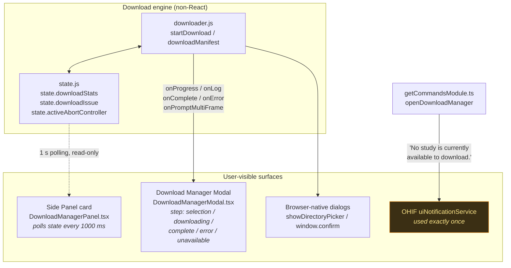
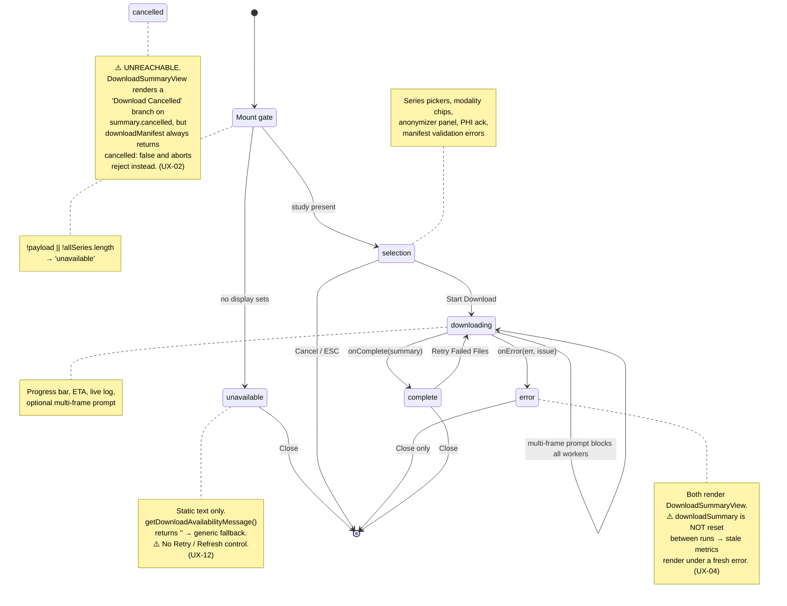
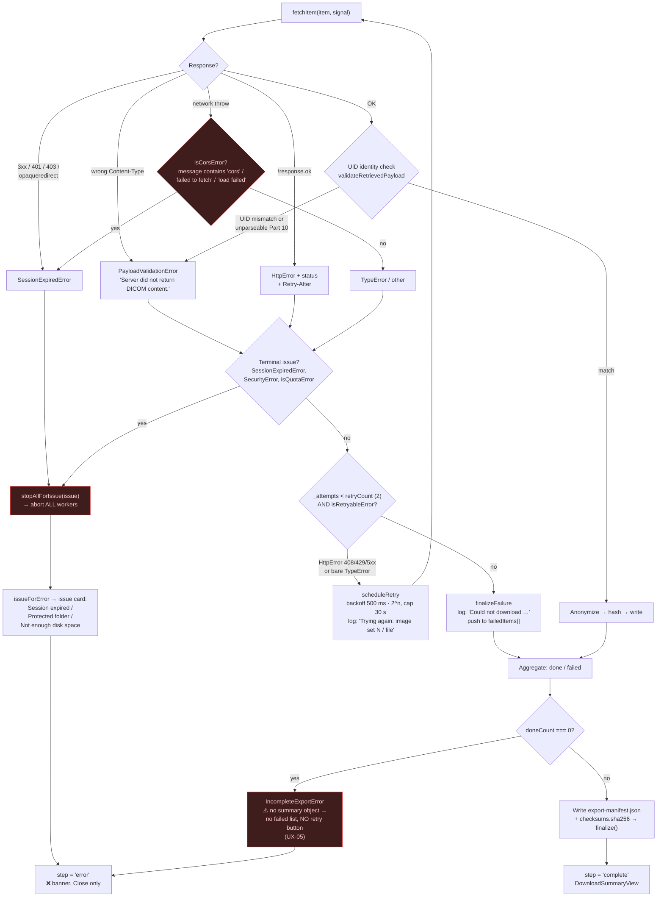
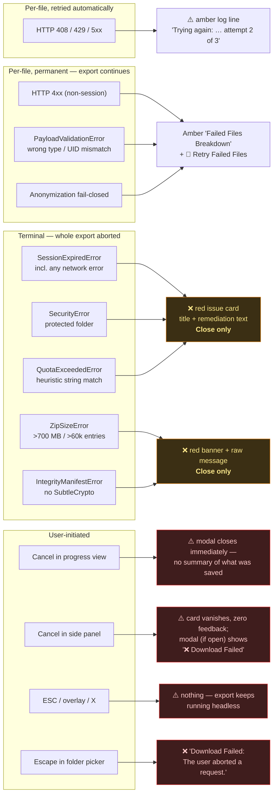
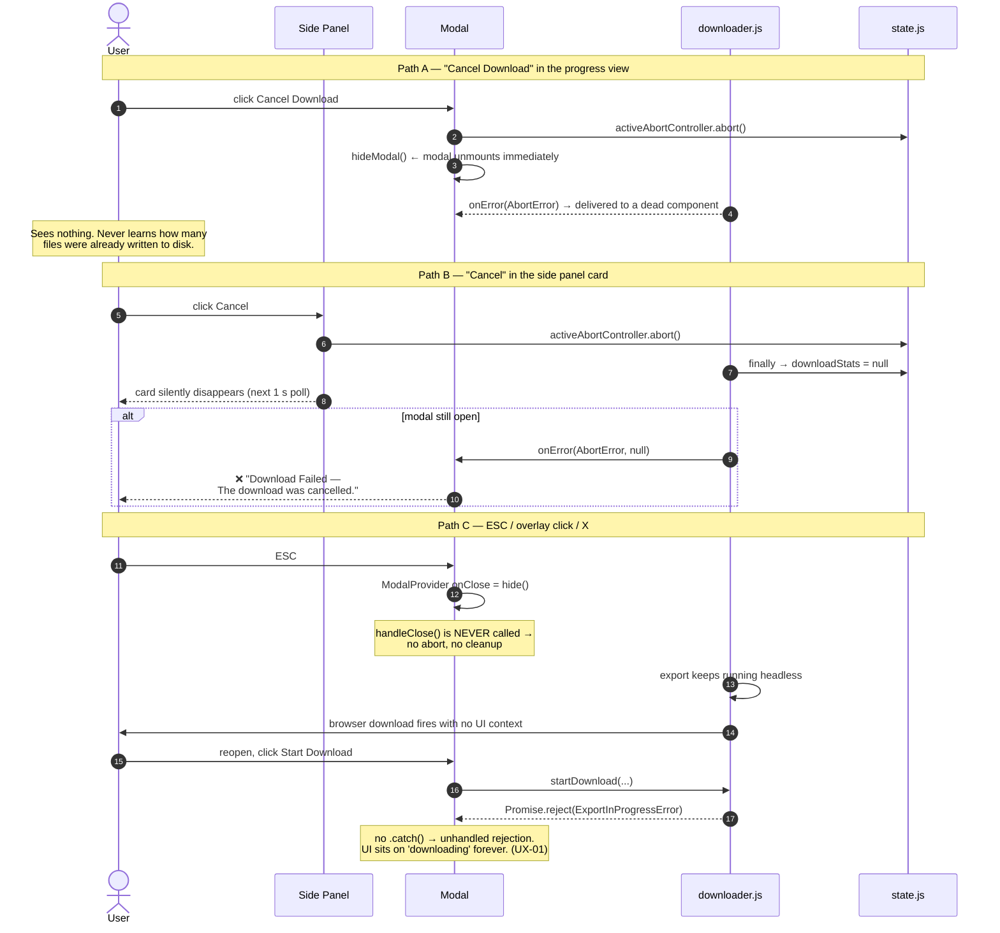
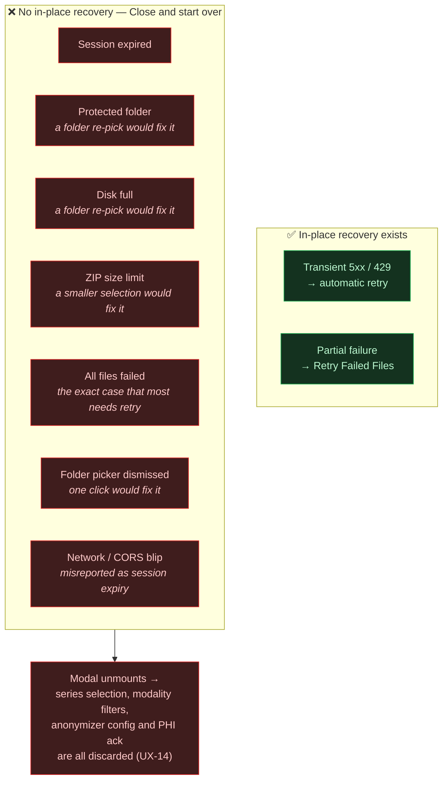
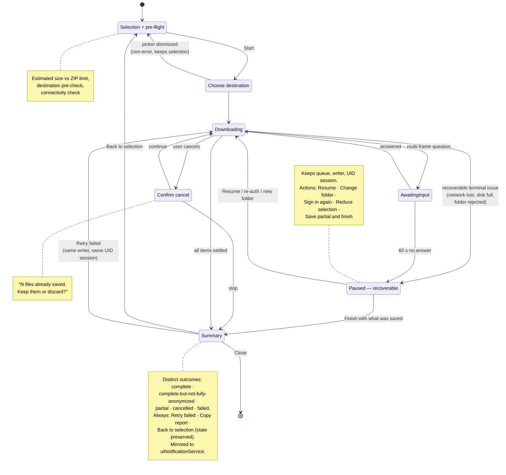

# 06. UI States, Messages, Failures & Retry Flows

> **Package**: `@ohif/extension-download-manager` (OHIF Viewer v3 Platform)
> **Scope**: everything the user *sees* and *can act on* when something goes wrong.
> **Companion document**: [`UI-shortcomings.md`](../UI-shortcomings.md) — how these flows should be improved.

## Developer-only raw DICOM diagnostics

The runtime option `window.config.aquestDownloadManager.devMode` defaults to
`false`. When explicitly set to `true`, final per-instance DICOM errors include
a clickable `SOPInstanceUID` in both the live activity log and retained summary
log. The resulting large diagnostic dialog shows a `dcmdump`-style listing of
all parsed elements except `(7FE0,0008)`, `(7FE0,0009)`, and `(7FE0,0010)`.
Transfer Syntax is repeated prominently above the dump.

The dialog can copy or download the text dump and download the raw response as
`.raw.dcm`. The raw response is captured before anonymization, pixel redaction,
hashing, and output-writer processing. If no body was received, the dialog
attempts one authenticated raw refetch. It never reconstructs a synthetic file
for frame-only sources.

This mode exposes identifiable data and may retain failed raw instances in
browser memory until the run log is reset or the modal unmounts. It must only
be enabled in trusted development environments.

This document diagrams the **as-built** behaviour of the extension's user interface: which
surfaces render messages, which state each surface can enter, how a failure is classified,
what the user is told, and what recovery actions are actually reachable from that point.

Diagrams marked **⚠️ as-built defect** show a path that behaves incorrectly today. Each is
cross-referenced to a finding ID in [`UI-shortcomings.md`](../UI-shortcomings.md).

---

## 1. UI surface map — where messages come from

There are four independent surfaces that can show the user a message, and they do **not**
share a single message bus.



**Key observation:** the engine pushes to the modal via callbacks, but the panel only
*polls global mutable state*. When the modal is unmounted, every `onError` / `onComplete`
message is delivered to a dead listener and is never shown anywhere.
→ *[UX-01](../UI-shortcomings.md#ux-01), [UX-11](../UI-shortcomings.md#ux-11)*

---

## 2. Modal state machine — as built



---

## 3. Error classification — from HTTP response to user message

This is the decision tree the engine walks for **every single instance**. The branch taken
decides whether the user sees a retry, a per-file failure, or a hard stop of the whole export.



**⚠️ as-built defect — the network-blip trap.** A transient `TypeError: Failed to fetch`
(Wi-Fi drop, proxy hiccup, one dropped connection out of thousands) matches `isCorsError`
and is rewritten into `SessionExpiredError` **inside `fetchItem`'s own catch — before the
retry check ever runs**. `SessionExpiredError` is terminal, so it aborts every worker and
tells the user *"Your viewing session ended … close this window, reopen the exam."* The
export is dead, the advice is wrong, and the retryable `TypeError` branch of
`isRetryableError` is effectively unreachable for network errors.
→ *[UX-06](../UI-shortcomings.md#ux-06)*

---

## 4. Failure taxonomy → what the user is told → what they can do



---

## 5. The retry flow — partial success

```mermaid
sequenceDiagram
    autonumber
    actor U as User
    participant M as DownloadManagerModal
    participant S as DownloadSummaryView
    participant D as downloader.js
    participant W as Writer (ZIP / Folder)

    D->>M: onComplete({done: 480, failed: 20, failedItems[…]})
    M->>S: step 'complete' → render
    S-->>U: ⚠️ "Download Completed with Warnings"<br/>480 of 500 saved · Retry Failed Files (20)

    U->>S: click "Retry Failed Files (20)"
    S->>M: onRetryFailed()
    Note over M: failedItems.map(f => f.item)<br/>handleStartDownload(items)

    rect rgb(70, 30, 30)
        Note over M: ⚠️ setDownloadLogs([]) wipes the<br/>evidence of the original failure (UX-08)
        Note over M: ⚠️ downloadSummary / downloadStats<br/>are NOT reset (UX-04)
    end

    M->>D: startDownload(callbacks, items, anonConfig, outputMethod)

    rect rgb(70, 30, 30)
        Note over D: ⚠️ resetAnonymizationSession()<br/>→ brand-new UID mapping table (UX-09)
    end

    alt outputMethod === 'folder'
        D->>U: showDirectoryPicker() — pick the folder AGAIN
        Note over U: no hint that it must be the<br/>same folder as the first pass
    else outputMethod === 'zip'
        D->>W: new ChunkedZipWriter → a SECOND, separate archive
    end

    D->>W: write 20 files
    D->>W: writeArtifact('export-manifest.json')<br/>writeArtifact('checksums.sha256')
    Note over W: ⚠️ describes only the 20 retried files —<br/>no combined manifest for the 500 (UX-10)
    D->>M: onComplete({done: 20, failed: 0})
    M->>S: ✅ "Download Complete — All 20 files saved"
    S-->>U: green banner
    Note over U: User now holds 2 archives, 2 manifests,<br/>and (with anonymization on) 2 different<br/>anonymous Study/Series UIDs for one study.
```



---

## 6. Cancellation — three entry points, three different outcomes



---

## 7. Multi-frame redaction prompt — a blocking question inside the progress view

```mermaid
sequenceDiagram
    autonumber
    participant A as anonymizer.js
    participant D as downloader.js
    participant M as Modal
    actor U as User

    A->>D: onPromptMultiFrameMethod({numberOfFrames: 240})
    D->>M: target.onPromptMultiFrame(…, resolve)
    M->>M: setMultiFramePrompt(...)
    Note over M: amber card renders ABOVE the progress<br/>view, inside a scrollable ScrollArea

    par all three workers stall
        D--xD: worker 1 awaiting resolve
        D--xD: worker 2 awaiting resolve
        D--xD: worker 3 awaiting resolve
    end

    Note over M,U: ⚠️ progress bar keeps its last value,<br/>ETA keeps counting down, spinner keeps<br/>pulsing → looks like a hang, not a question.<br/>If the user scrolled down, the prompt is<br/>off-screen entirely. (UX-13)

    U->>M: "Aggressive" or "Sampling"
    M->>D: resolve(method)
    Note over D: anonOptions.multiFrameRedactionMethod = method<br/>⚠️ applied to the WHOLE export; the copy<br/>never says the choice is one-shot and final.
    D->>A: continue
```

---

## 8. Message inventory

| # | Message (user-facing) | Type | Surface | Source | Reachable action |
|---|---|---|---|---|---|
| 1 | "No study is currently available to download." | info toast | notification | `getCommandsModule.ts:24` | dismiss |
| 2 | "Your medical images are not ready yet…" | inline | modal `unavailable` | `DownloadManagerModal.tsx:249` | *none* |
| 3 | "This selection cannot be exported." + list | error | modal `selection` | `DownloadManagerModal.tsx:448` | fix selection |
| 4 | "Before the download starts, you will be asked where to save…" | tip | modal `selection` | `DownloadManagerModal.tsx:258` | — |
| 5 | "If your browser asks to allow multiple downloads, choose Allow…" | warning log | progress log | `downloader.js:252` | — (logged at t=0, needed at t=end) |
| 6 | "Trying again: image set N / file (attempt 2 of 3) after 1 seconds." | warning log | progress log | `downloader.js:310` | — |
| 7 | "Could not download image set N / file: `<error>`" | error log | progress log | `downloader.js:332` | — |
| 8 | "Not anonymized: … — MP4 content is exported as retrieved…" | warning log | progress log + audit card | `downloader.js:372` | — |
| 9 | "Preparing the final verified download file, please wait…" | info | progress | `downloader.js:538` | — (no progress, can last minutes) |
| 10 | "Download Complete" ✅ | banner | summary | `DownloadSummaryView.tsx:91` | Close |
| 11 | "Download Completed with Warnings" ⚠️ | banner | summary | `DownloadSummaryView.tsx:93` | **Retry Failed Files** ×2, Close |
| 12 | "Download Cancelled" ⚠️ | banner | summary | `DownloadSummaryView.tsx:95` | **unreachable** |
| 13 | "Download Failed" ❌ | banner | summary | `DownloadSummaryView.tsx:96` | Close |
| 14 | "Session expired" | issue card | summary | `downloader.js:748` | Close |
| 15 | "Protected folder selected" | issue card | summary | `downloader.js:758` | Close |
| 16 | "Not enough disk space" | issue card | summary | `downloader.js:768` | Close |
| 17 | "The requested export exceeds the safe single-archive limit; no archive was downloaded." | raw error | summary | `zipWriter.js:42` | Close |
| 18 | "All N requested instance(s) failed to download; no files were saved." | raw error | summary | `downloader.js:483` | Close |
| 19 | "The user aborted a request." | raw browser error | summary | `showDirectoryPicker` rejection | Close |
| 20 | "Multi-Frame DICOM Redaction Mode Required" | blocking prompt | progress | `DownloadManagerModal.tsx:479` | Aggressive / Sampling |

**Register mismatch.** Rows 1–11 are written in plain patient-facing language; rows 17–19
leak engineering strings and browser internals into the same red banner, with no error code,
no "what to do next", and no way to copy a report.
→ *[UX-15](../UI-shortcomings.md#ux-15)*

---

## 9. Recovery coverage matrix

Which failures can the user actually recover from **without** losing their selection and
anonymization configuration?



---

## 10. Proposed target-state flow

The shape the UI should converge on. Rationale and per-item detail in
[`UI-shortcomings.md`](../UI-shortcomings.md).



---

## Navigation

- Previous: **[05. Storage Writers & Troubleshooting](./05-storage-directory-layout-troubleshooting.md)**
- Related: **[UI-shortcomings.md](../UI-shortcomings.md)** — improvement backlog
- Index: **[Documentation Suite](./index.md)**
